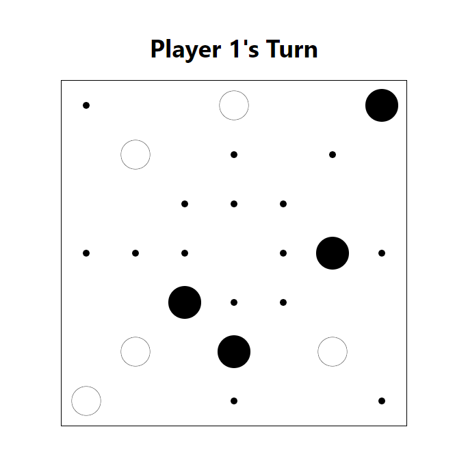
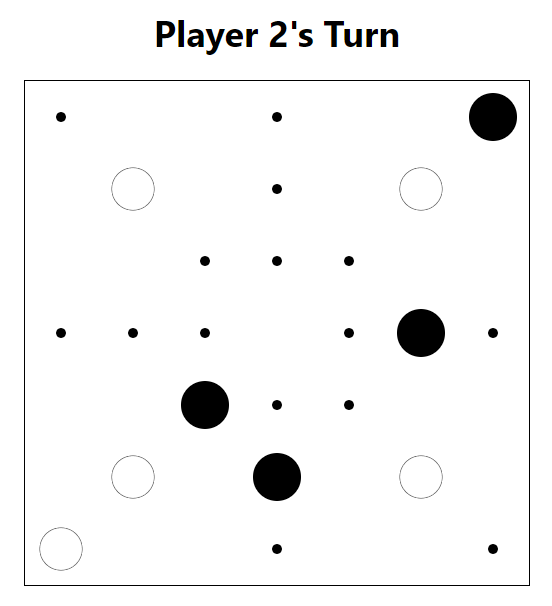
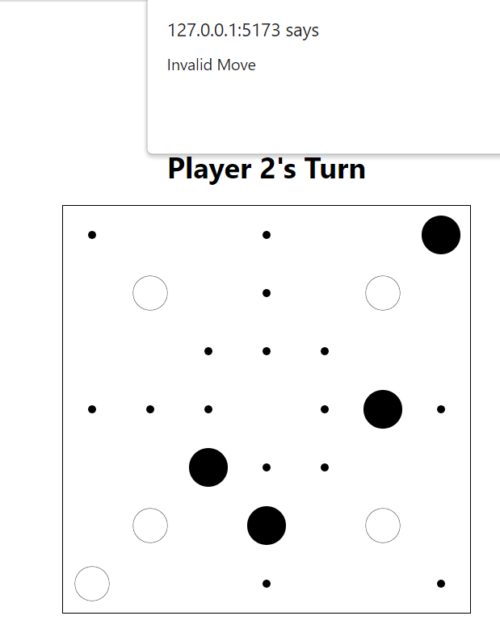

# FIT3077_project 

# Contact Team Cabbage
Euan Lim | GrassyAirplane - elim0062@student.monash.edu  
Zoe Tay | NiftyCoffee - ztay0013@student.monash.edu  
Lim Zheng Haur | Zach - zlim0038@student.monash.edu  

# About Application
The Application is built in Two parts.  
The Client Frontend in React Vite TS  
The Server Backend in Java Springboot  
 
The Restful API the Client interacts with can be found in `server/src/main/java/com/team8/backend/WebController.java`
 
The main Project files for Nine Man Morris can be found in `server/src/main/java/com/team8/backend/ninemanmorris`
 

<h1>JAVA VERSION 17</h1>

*Running With Docker*
# Docker (After Building Individual Docker folders)
`docker compose build`
`docker compose up`

# Docker (Manual)
`cd server`  
`docker build -t 9mm-backend:0.0.1 .`   
`docker run -it  -p9999:9999 backend-image-id`  

`cd client`  
`docker build -t 9mm-frontend:0.0.1 .`  
`docker run -it  -p5173:5173 frontend-image-id`  

*Running without Docker*
# Start Backend
`navigate to root` 
`cd server`  
`./gradlew build`  
`java -jar build/libs/backend-0.0.1-SNAPSHOT.jar`  

# Start Frontend
`navigate to root` 
`cd client`  
`npm install`  
`npm run dev`  

# Instructions & Important to note
1) Advised to start the Backend before the Frontend, as the population of the FE relies on the BE data  
2) To move, click, hold, drag and drop the pieces on the board display  
3) White player goes first  
4) The Backend is hosted on port 9999, and enables cors from all sources  
5) Advised to run FE & BE on seperate shell instances

## Project ##
Currently, the board initially starts with 9 pieces, 5 white 4 black.  
 
Making a move as the first player (default to white), swaps to second player  
 
Making a move when not the turn, pings as invalid move and prevents  
 
Lastly attempting to move to blank spaces or ontop of opposite color also pings as invalid 

*Important to note, without the backend a default board is still loaded but without invalid checking or turn swapping* 